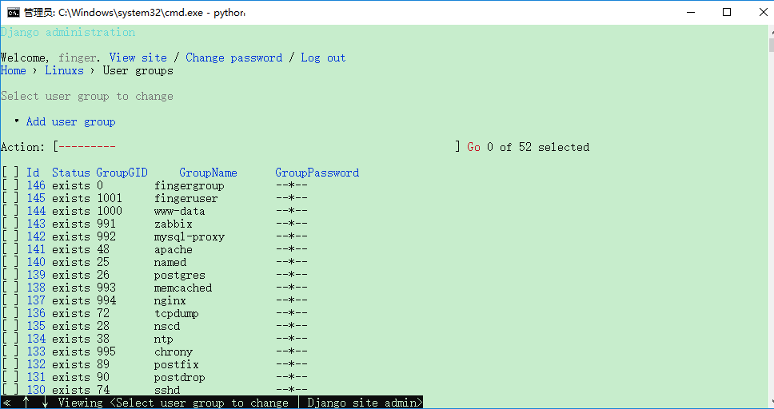
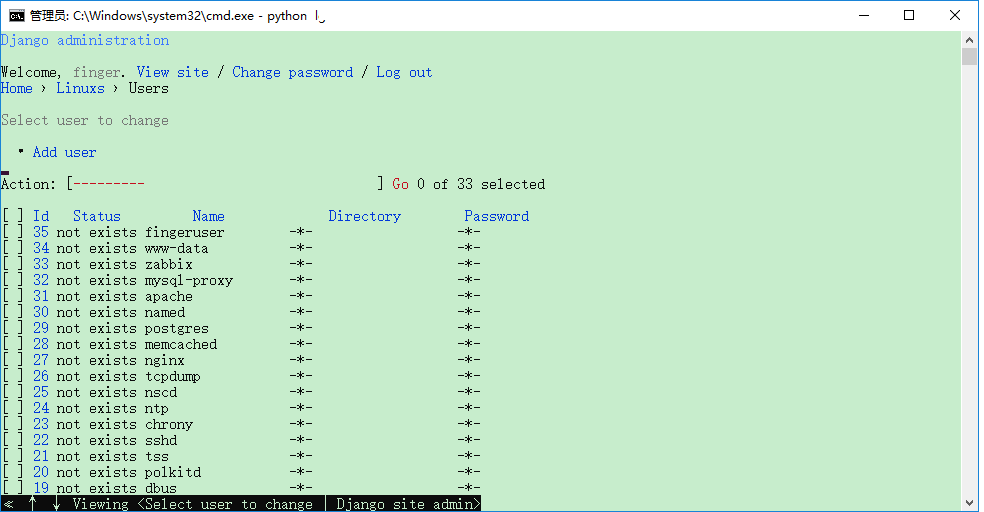

#linux用户管理系统
##由来：
###之前在一家互联网公司工作，发现他们的主机所有的节点都只有一个root用户，postgres也是采用了默认的用户，于是觉得有必要把这部分用户管理做得更加人性化，就产生了这个linux 用户管理的系统。
###这个系统能够获取到部署的linux节点的所有usergroup 和 user ，能够对usergroup 和 user 进行基本的删改增的操作，使linux的用户管理更加的人性化
##系统后期能够完善的功能:
###需要增加主机节点，能对主机节点进行用户和用户组的操作(前提是root权限),采用分布式的，不需要再每一个节点拷贝django的主要程序代码
###需要增加mysql 和 postgresql 数据库的 user 和 role 的管理
##目前实现的效果如下:
可以对usergroup 进行基本的操作，并且能提取出当前节点已经存在的group

可以对user进行基本的操作，并且能提取出当前节点已经存在的user

